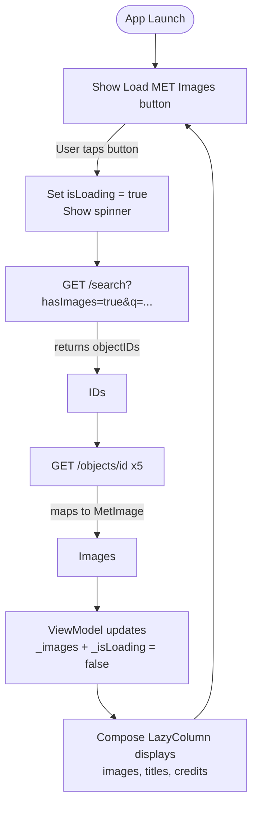
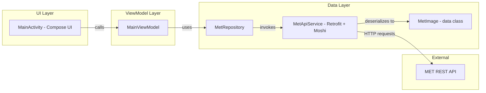

```mermaid
flowchart TD
  Start([App Launch])
  Start --> Idle[Show Load MET Images button]
  Idle -->|User taps button| Loading[Set isLoading = true\nShow spinner]
  Loading --> FetchIDs[GET /search?hasImages=true&q=...]
  FetchIDs -->|returns objectIDs| IDs
  IDs --> FetchObjects[GET /objects/id x5]
  FetchObjects -->|maps to MetImage| Images
  Images --> UpdateState[ViewModel updates\n_images + _isLoading = false]
  UpdateState --> Render[Compose LazyColumn displays\nimages, titles, credits]
  Render --> Idle
```

```mermaid
flowchart LR
  subgraph UI_Layer["UI Layer"]
    A[MainActivity - Compose UI]
  end
  subgraph ViewModel_Layer["ViewModel Layer"]
    B[MainViewModel]
  end
  subgraph Data_Layer["Data Layer"]
    C[MetRepository]
    D[MetApiService - Retrofit + Moshi]
    E[MetImage - data class]
  end
  subgraph External["External"]
    F[MET REST API]
  end
  A -->|calls| B
  B -->|uses| C
  C -->|invokes| D
  D -->|deserializes to| E
  D -->|HTTP requests| F
```
