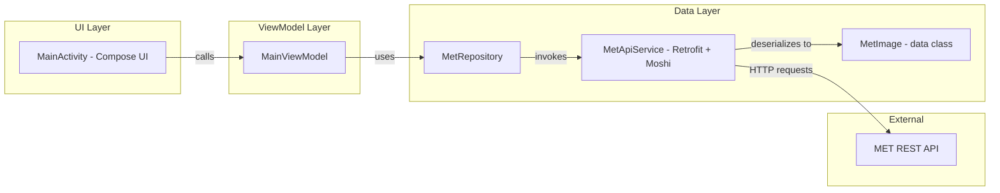

# MET Image Viewer

An Android application that fetches and displays public‑domain artworks from the Metropolitan Museum of Art (MET) Collection API. Built with modern Android architecture patterns for maintainability, testability, and a smooth user experience.

---

## 📖 Project Overview

Users can load batches of museum artworks on demand by tapping a button. The app displays each image along with its title, artist, and creation date in an infinite scroll-style list.

This project demonstrates:
- Single-Activity MVVM architecture with **ViewModel**, **LiveData**, and **Data Binding**
- Repository pattern for clean data access and separation of concerns
- Retrofit + Moshi for network calls and JSON parsing
- Kotlin Coroutines for asynchronous background work
- Hilt for dependency injection
- Glide for efficient image loading and caching
- Material design components for modern Android UI

---

## 🚀 Features

- **Load on Demand**: Fetch and display a new batch of 10 random MET artworks with each button tap
- **Smooth Scrolling**: RecyclerView with CardViews, view binding, and automatic diffing
- **State Handling**: Loading spinner and error Snackbar for network feedback
- **Modular Architecture**: Easily swap implementations or add local caching

---

## 🏗 Architecture

```
MainActivity
    ↕ observes
ImageViewModel
    ↕ calls
MetRepository
    ↕ uses
Retrofit (MetApiService)
    ↕ parses
Moshi DTOs
```

Key patterns:
- **MVVM**: Clear separation between UI and data logic
- **Repository**: Abstracts data retrieval (network-only in this case)
- **Dependency Injection**: Hilt provides singletons and manages lifecycles

---

## 🛠 Tech Stack

- **Language**: Kotlin
- **UI**: AndroidX, Material Components, ViewBinding
- **Networking**: Retrofit 2.9.0, Moshi 1.16.0
- **DI**: Hilt 2.44
- **Async**: Kotlin Coroutines 1.7.3
- **Image Loading**: Glide 4.16.0

---

## 📥 Installation & Setup

1. Clone this repository:
   ```bash
   git clone https://github.com/yourusername/MetImageViewer.git
   ```
2. Open in Android Studio and let Gradle sync.
3. Ensure `gradle.properties` contains:
   ```properties
   android.useAndroidX=true
   android.enableJetifier=true
   ```
4. Run on a device or emulator with internet access.
5. Tap **Load Images** to start browsing MET artworks!


## 📄 User FLow

## 📄 Architecture Flow

